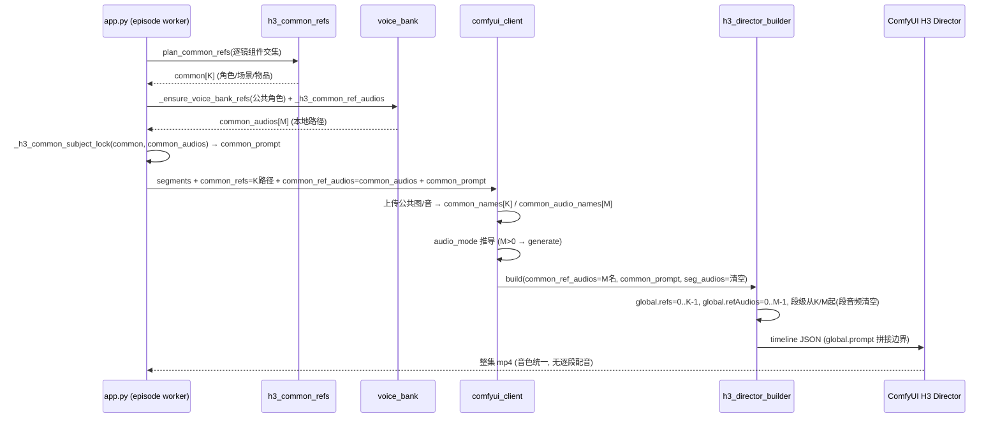
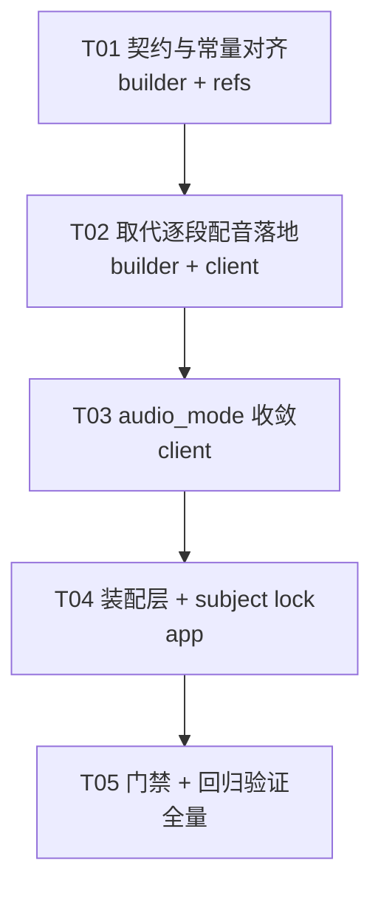

# 系统设计文档 · H3 Director「公共参数」跨模块改造

> 架构师：高见远（software-architect）　模块：漫剧生成系统 · H3 Director 公共参数
> 范围：**设计 + 任务分解**（不含实现代码）。用户最终口径：公共池 = 本集**全部分镜都出现**的 {角色图、场景图、物品图} + **角色参考音色**；公共参考音色**取代逐段 QwenTTS 配音**。

---

## 0. 现状勘误（先校正事实，再设计）

工作区 `git status` 显示 `app/*.py` 处于**大量未提交的编辑中**状态，`h3_director_builder.py` 在我两次读取之间行号漂移（`_ref_audio_items` 从 535 → 561、`build` 从 997 → 1069）——**工程师正在并发实现**。因此本设计的价值是把「目标态契约 + 不变量 + 门禁」钉死，而不是复述已落地的代码。

已核实**已接线**（勿重复造）：
- `comfyui_client.generate_h3_sequence_sequential` / `generate_h3_sequence` 已透传 `common_refs / common_ref_audios / common_prompt`。
- `h3_director_builder.build()` / `_build_timeline()` 已新增 `common_ref_audios / common_prompt` 形参；`_build_timeline` 已把 `global.prompt = str(common_prompt or "")`、`global.refAudios = _ref_audio_items(common_ref_audios)`。
- `build()` 守卫 `_guard_global_prompt` 已改成「仅当 `common_prompt` 为空且 `global.prompt` 非空才清空」（模板残留才清），主动传入的 subject lock 保留。
- `app.py` 已有 `_ensure_voice_bank_refs` / `_h3_common_ref_audios` / `_h3_common_subject_lock`，并在 episode 与 per_shot 两个调用点派生 `_common_audios / _common_prompt`。

已核实的**真实缺口（工程师待补）**：
| # | 缺口 | 位置 | 后果 |
|---|---|---|---|
| G1 | **音频槽位无 `start` 参数**：`_ref_audio_items(names)` 恒从 index 0 起 | `h3_director_builder.py:561` | 公共音色占 `global.refAudios` index `0..M-1`，段级 `refAudios` 也从 0 起 → 插件 `merge_indexed_refs` **同 index 段级覆盖公共**，公共音色**静默失效**（图的 G1 类比，最难查） |
| G2 | **「取代逐段配音」未在 builder 落地**：注释声称「段级 refAudios 置空（见 build() 的 common_ref_audios 分支）」，但 `build()` 内 **无该分支**，`seg_audio_lists` 从不因 `common_ref_audios` 非空而清空 | `h3_director_builder.py:1178-1184` | 只要将来有段级配音，就与公共音色**抢槽**（叠加 G1 即静默错声） |
| G3 | **音频总预算未校验**：`MAX_REFERENCE_AUDIOS=3` 是「公共 M + 段级」总和，无 M+seg ≤ 3 守卫 | `h3_director_builder.py` / `comfyui_client.py` | M=3 时若再挂段级 → 第 4 个被 `_ref_audio_items` 静默丢弃，`<Audio N>` 编号与音频错位 |
| G4 | **`check_ref_layout` 只查图、不查音频**：音频静默错位无自检 | `h3_director_builder.check_ref_layout` | G1/G2 无阻断，只能靠线上听感发现 |
| G5 | **subject lock 未把 `<Audio N>` 绑到角色**：现文案只列 `<Audio 1>…<Audio M>`，未写「哪支音色是谁」 | `app.py:_h3_common_subject_lock` | generate 模式下多角色同场，模型无 speaker↔音色映射 → 音色串味 |
| G6 | **audio_mode 语义分歧**：team-lead 口径写「source/fully_copy」，但官方 `docs/r2v-source-audio.md` 明确 source = 参考 wav **原样 mux**、台词须与音频一致 | `comfyui_client.py:4028-4043`（工程已选 `generate`） | 若按 source 实现，**同一句参考音频会被灌进每一段**（台词全错配）。**必须 generate**，见 §5 风险 R1 |
| G7 | **公共池必须按实际 path/state 判交集**：角色现在按镜头选择不同 Machine Anchor / outfit；同名但 path 不同绝不能合并 | `app/api/_shared.py:_h3_shot_ref_components` / `h3_common_refs.asset_key` | 若只按角色名合并，会把某一镜的服装/景别锚点焊死给全集 |

> `_shot_segment` 的切段契约 `return _segs, sb_local` 是**真契约**（`app.py:8000`），不得改；`_ensure_voice_bank_refs` 的自动补音色走 `all_characters=char_idx`，**不可**把公共池角色之外的角色也塞进 `global.refAudios`（公共池 ≠ 全角色）。

---

## 1. 文件清单（含相对路径，一行一句）

| 文件 | 相对路径 | 改什么 |
|---|---|---|
| 公共池判据 | `app/h3_common_refs.py` | `asset_key` 同时纳入 `common_key` 与实际 path；同名角色不同 outfit/Machine Anchor 不进入公共池 |
| 构建器 | `app/h3_director_builder.py` | ① `_ref_audio_items` 增 `start` 形参（音频版错位保护）；② `build()` 新增「`common_ref_audios` 非空 → 清空段级 `seg_audio_lists`」分支（取代逐段配音）；③ 音频总预算 M+seg ≤ `MAX_REFERENCE_AUDIOS` 守卫；④ `check_ref_layout` 扩到音频槽；⑤ `layout` 增 `common_ref_audios` 报表字段 |
| 客户端 | `app/comfyui_client.py` | ① `audio_mode` 推导确认：`common_audio_names` 非空 → **generate**（非 source），显式传入优先；② `common_audio_names` 非空时**不再**上传/安放段级 `seg_audio_names`（双保险清空）；③ `_drop_missing_director_refs` 一并校验 `global.refAudios` 已落地；④ `layout["common_ref_audios"]` |
| 装配层 | `app/app.py` | ① `_h3_common_subject_lock` 把 `<Audio N>` 绑定到「角色名 + reference 关键词」；② episode/per_shot 两调用点传 `common_ref_audios=_common_audios`（已接）并**确保不传段级 `seg_audios`**；③ `_h3_plan_common_refs` 传 `project_name`/归一后组件（已接，需配 G7）；④ 保留 `_shot_segment` 的 `return _segs, sb_local` |
| 提示词口径 | `app/h3_prompt_kit.py` / `app/prompt_memory.py` | 核对：公共 prompt 里 `<Picture N>`/`<Audio N>` 编号与 `_BOILERPLATE` 去重；数值（9/3）与常量同源 |
| 文档 | `docs/system_design.md`（本文件）、`docs/sequence-diagram.mermaid` | 设计留痕 |

> 前端（`frontend/src/pages/ProjectWorkbenchPage.tsx`）若涉及流水线步骤序列调整（见 §6 风险 R4），由流水线工作流同步；**本特性核心不改前端**。

---

## 2. 数据流 / 槽位不变量

### 2.1 端到端数据流



### 2.2 槽位不变量（硬约束，QA 逐条断言）

| 常量/不变量 | 规则 | 同源 |
|---|---|---|
| **K（公共图）** | `global.refs` 占图片 index `0..K-1`；段级图 index 从 `K` 起 | `_ref_items(refs, start=0)` / `_ref_items(seg, start=K)` |
| **M（公共音频）** | `global.refAudios` 占音频 index `0..M-1`；`<Audio N>` = index+1（1-based） | `_ref_audio_items(common)` |
| **段级音频** | 「取代逐段配音」→ **段级 `refAudios` 必须清空**（`seg_audio_lists = []`）；若未来保留，index 必须从 `M` 起 | `_ref_audio_items(names, start=M)` |
| **图总预算** | `K + 段级自有图 ≤ MAX_REFERENCE_IMAGES(9)` | `room = 9 - K`，超则按「角色→物品→场景」截断 |
| **音频总预算** | `M + 段级音频 ≤ MAX_REFERENCE_AUDIOS(3)`（**总和**，非各自 ≤3） | `MAX_REFERENCE_AUDIOS` |
| **audio_mode 推导（取代逐段配音）** | `M>0` → **`generate`**（公共音色作条件锁音色，模型按各段台词自生成）；`M==0 且段级音频存在` → `source`；否则 `generate`/`mute`。**source 与 generate 互斥，不可叠加** | `comfyui_client.py:4028-4043` |
| **commonEnabled** | `common_enabled = bool(refs) or bool(common_ref_audios) or bool(common_prompt)`；三者任一非空即需拼接 | `h3_director_builder.build()` |
| **`_guard_global_prompt` 取舍** | **保留**，但仅在 `common_prompt` 为空时清 `global.prompt`（清模板残留）；有 `common_prompt` 时**不清**（那是本集 subject lock） | `build()` |
| **切段契约** | `_shot_segment` 必 `return _segs, sb_local`（列表，非单元素） | `app.py:8000` |

---

## 3. 公共 prompt subject lock 文案范式

插件在 `commonEnabled` 时执行 `common + "\n\n" + segment`（`plan.py:concat_common_segment_prompt`）——公共句**拼在每段提示词之前**，作全集一致前缀。

**编号约定**：模型认 `<>` 标签（`<Picture N>` / `<Audio N>`，1-based 对应 index 0-based）；`@image#N` / `@audio#N` 只是 ComfyUI 前端 chip，**不进模型**。故文案一律用 `<>`。

**范式（target）**：
```
[COMMON REFERENCE — holds identically for every shot]
<Picture 1> is 林昭 (character) — <appearance>. Keep his facial identity, hairstyle, build and outfit identical in all shots.
<Picture 2> is 实验室 (scene) — keep the spatial layout and lighting anchor; framing follows the per-shot camera, not this image.
<Picture 3> is 青铜剑 (prop) — keep its shape, material and colours identical in all shots.
<Audio 1> is 林昭's reference voice — deliver every line spoken by 林昭 in this timbre (reference the voice, do NOT copy its words).
<Audio 2> is 苏晚's reference voice — …
```

**边界与要点**：
1. **`<Audio N>` 必须绑定「角色名」**（G5）：generate 模式下多角色同场，需显式 speaker↔音色映射，否则音色串味。
2. **必须含 `reference` 关键词**（官方 `docs/r2v-source-audio.md:36`：生成声音路径 prompt 写 `reference`）；**禁写 `fully_copy`**（那是 source 专用，见 §5 R1）。
3. **公共段只放「镜头无关」内容**：subject 锁定 + 世界观 + 全局 STYLE/画幅。**镜头特有的动作/构图/景别/运镜/光线只进段级**，否则会被复制到每一段。
4. **数值同源**：文案里的槽位计数若出现，必须引用常量，禁硬编码副本。
5. **去重**：`h3_prompt_kit` 段级提示词若已含 `<Picture 1>` 构图基准句（`build_detailed_description`），需确认公共 K 图不与之冲突（分镜图落 `<Picture K+1>`，见 `h3_prompt_kit.py:891-920` 已有处理）。
6. 与 `prompt_memory._BOILERPLATE` 的措辞如需同步，纳入同一任务改，避免两处口径漂移。

---

## 4. 有序任务列表（按实现顺序，标注落点）

> 约定：`[builder]` = `app/h3_director_builder.py`；`[client]` = `app/comfyui_client.py`；`[app]` = `app/app.py`；`[refs]` = `app/h3_common_refs.py`。

| 任务 | 名称 | 落点/文件 | 依赖 | 优先级 |
|---|---|---|---|---|
| **T01** | **契约与常量对齐**：`_ref_audio_items` 增 `start`；音频总预算 M+seg≤3 与图预算 K+seg≤9 守卫；`check_ref_layout` 扩音频槽；`layout` 增 `common_ref_audios`；角色路径归一（`outfits/…/base.png` → 主 `base.png`） | `[builder]` `[refs]` | — | P0 |
| **T02** | **「取代逐段配音」落地**：`build()` 内 `common_ref_audios` 非空 → 清空 `seg_audio_lists`；`[client]` 同步「公共音色生效则不上传/不安放段级音频」双保险；音频上传去重 | `[builder]` `[client]` | T01 | P0 |
| **T03** | **audio_mode 语义收敛**：确认 `M>0 → generate`（非 source）、显式优先、source/generate 互斥；`_drop_missing_director_refs` 连带校验 `global.refAudios` 已落地 | `[client]` | T02 | P0 |
| **T04** | **装配层 + subject lock**：`_h3_common_subject_lock` 把 `<Audio N>` 绑角色名 + 补 `reference` 关键词；episode/per_shot 两调用点确保「公共音色生效即不传段级 `seg_audios`」；`_h3_plan_common_refs` 传 `project_name`/归一组件（G7）；**保持 `return _segs, sb_local`** | `[app]` | T03 | P0 |
| **T05** | **门禁 + 回归**：`py_compile` 全部改动 py → `pyflakes` 扫 undefined name → `tsc --noEmit`；离线探针断言交集判据、`<Audio N>` 连续性、无音色 fallback、`commonEnabled` 拼接；工作流 JSON 结构回归（节点/连线不炸） | 全量 | T04 | P0 |

> 任务数 = 5（符合上限）。T01 为「契约基线」任务（对应新项目的「基础设施」位）；T02→T03→T04 为**必要线性链**（同一特性的三层），T05 独立收口。若并行资源充足，T01 与「前端/流水线」工作流无耦合，可各自推进。

---

## 5. QA 断言建议（交给 QA 严过关）

| 类别 | 断言 | 期望 |
|---|---|---|
| 交集判据 | 全段同角色+同场景+同物品 → 进公共池；仅 5/30 镜出场的配角 → **排除** | `plan_common_refs` 只返回交集 |
| 交集判据（服装） | 同角色跨镜换装（outfits 变体）→ 归一到 `base.png` 后**仍命中**交集，且段级不重复挂变体 | 公共 1 槽、段级 0 槽 |
| 交集判据（单段/缺分镜图） | `len(shots)<2` 或任一镜缺分镜图 → 返回 `([],{})`，零行为变更 | 不启 commonEnabled |
| audio_mode | M>0 → `generate`；M==0 且段级音频存在 → `source`；显式传入优先 | 三者互斥，无叠加 |
| 取代逐段配音 | 公共音色生效时 `segment.refAudios == []` | 段级音频清空 |
| `<Audio N>` 连续性 | 公共音色数 = M → `global.refAudios` index `[0..M-1]` 连续无洞；段级（若存在）从 M 起 | 无 index 重叠/空洞 |
| `<Picture N>` 连续性 | 公共 K → `global.refs` index `[0..K-1]`；段级从 K 起；提示词标签 = index+1 | 一一对应 |
| 无 voice_bank 音色 fallback | 公共角色无绑定音色 → 不进 `global.refAudios`；M 相应减小；若 M=0 → audio_mode 回落 origin | 降级为 generate（模型自生成），不崩 |
| 空/缺失音频文件 | `common_ref_audios` 中不可用路径 → 跳过并重算 M；**不**让 `<Audio N>` 空洞 | 编号仍连续 |
| 工作流结构回归 | 开/关 commonEnabled 两态下，Director 节点/连线/`SaveVideo`/`CreateVideo` 数量与结构不变；仅 timeline JSON 内 `global.*` 与段 `refs/refAudios` 变化 | 不炸结构 |
| 守卫 | `common_prompt` 非空时 `global.prompt` 保留；模板残留（空 common_prompt + 非空 global.prompt）被清 | 与 `_guard_global_prompt` 一致 |
| 预算 | K+段级图 ≤9；M+段级音频 ≤3；超限截断有 warning | 无静默丢弃 |

---

## 6. 风险与待确认项

| # | 风险/待确认 | 说明与建议 |
|---|---|---|
| **R1** | **source vs generate（最高优先级）** | 官方 `docs/r2v-source-audio.md`：`source` = 参考 wav **原样 mux**，prompt 须 `fully_copy`、台词须与音频一致；否则**同一句参考音频灌进每一段**、口型错位。公共音色是「一句固定样本」，**不可能**匹配每段台词 → 必须 **`generate`**（音色作条件、台词由模型按各段生成）。team-lead 口径写的 source/fully_copy **语义上不可行**，工程代码已选 `generate`——**需向用户明示并确认**「统一音色 + 模型生成台词」即为「取代逐段配音」的落地语义。 |
| **R2** | 公共角色**无** voice_bank 参考音色 | 现状：`_h3_common_ref_audios` 跳过缺音色角色、M 减小；`_ensure_voice_bank_refs` 会自动补一句短样本。**待确认**：自动补的「我是X，这是我的声音样本」是否可作为合格音色锚点（可能与正式配音音色不一致）？建议：缺音色角色**不锁音色**（从 `<Audio N>` 移除），而非用自动样本硬锁。 |
| **R3** | 台词时长与参考音频不一致 | generate 模式下**不 mux**，时长由模型按段时长生成 → 无「时长不匹配」崩溃面；仅**口型/节律**受条件影响。若误用 source 才会暴露此风险（→ 回到 R1）。 |
| **R4** | **与流水线 `mix` 步互斥（本特性必须「禁用 mix」而非「删步」）** | 本特性走 H3 生成期 `generate`（`comfyui_client.py:4033-4039`），H3 成片音轨**已含角色对白人声**；而流水线默认 `enable_mix=True`，`_mix_prepare` 会把这份人声处理掉再叠 QwenTTS：**情况 A** 有逐镜分离音效轨时 `H3_SFX_ISOLATE=True` → `sfx_isolate.resolve_stems` 明确「3=Vocals 人声永远不要」(`sfx_isolate.py:57`) → H3 人声被剔除、改叠 QwenTTS → **特性产物被替换**；**情况 B** 无分离音效轨时走 `app.py:15320-15322`「直接用原音轨垫底(可能含 H3 说话声)」→ `keep_original_audio=True` + TTS 叠加 → **双重人声**（H3 0.3 + TTS 1.0）。⇒ 要落地「公共音色取代逐段 QwenTTS」，须让 `mix` 不执行（`_deliverable_of` 回退 upscale/final，二者携 H3 原生音轨，且 `step_upscale` 已 `attach_audio=True` 可保留）。**✅ 2026-10-04 已落地**（用户决策 8 步序）：`tts`/`mix` 从 `STEP_SEQUENCE` 移除，且 `enable_mix` 在 `DEFAULT_CONFIG` 与 `autopilot.PLAN_DEFAULTS` **两处**默认改 `False`；`step_tts`/`step_mix` 函数体与 `STEP_RUNNERS`/`PROBES` 条目**保留**，回滚只需把键加回序列。另：`H3_AUDIO_SOURCE`（`config.py:664`，`audioMode=source` 参考音原样 mux）与本特性 `generate` 是两条不同链路，**不可混用**。 |
| **R4b** | `upscale` 前移 | **✅ 2026-10-04 已落地**（用户 8 步序要求）。原先只挪位置不改 `src` 会恒 `skipped`（静默失效），已按本行预判逐项同步：(a) `step_upscale` 的 `src` 改为**集级原片**（`probe_video.file` → 回退 `mix_output_path` → `final_path`）；(b) `step_final` 整集分支**优先消费 `upscale_path`**（`_playable` 判据，落空回退整集原片），逐镜分支不消费超分产物；(c) 前端 `ProjectWorkbenchPage.tsx:276-285` 的 `PRODUCTION_STEPS` 已同步 8 项同序。守卫 `.workbuddy/test/verify_pipeline_8steps.py` 锁「有序全等 + 前后端逐位一致 + AST 断言 `step_final` 真引用 `upscale_path`」。 |
| **R5** | 多角色音色串味 | generate + 公共音色共享集合，多角色同场靠 subject lock 的 speaker↔`<Audio N>` 映射约束（G5）。**待确认**：模型对映射的遵循度；建议质检加「音色一致性」抽查项。 |
| **R6** | 服装变体与公共池 | 归一到 `base.png` 后，公共角色在段级**丢失换装变体**（段级只挂公共那张 base）。**待确认**：公共角色是否需要「按镜换装」？若需要，则换装角色**不能**进公共池（牺牲公共锁定换服装多样）。 |
| **R7** | MEMORY 铁律 | 改 `app/*.py` **必须重启后端**（交付总结提醒用户）；三道门禁 `py_compile`/`pyflakes`/`npx tsc --noEmit`；`<Audio N>` 1-based、index 0-based；source/generate 互斥；提示词数值与常量同源。 |

---

## 7. 任务依赖图


